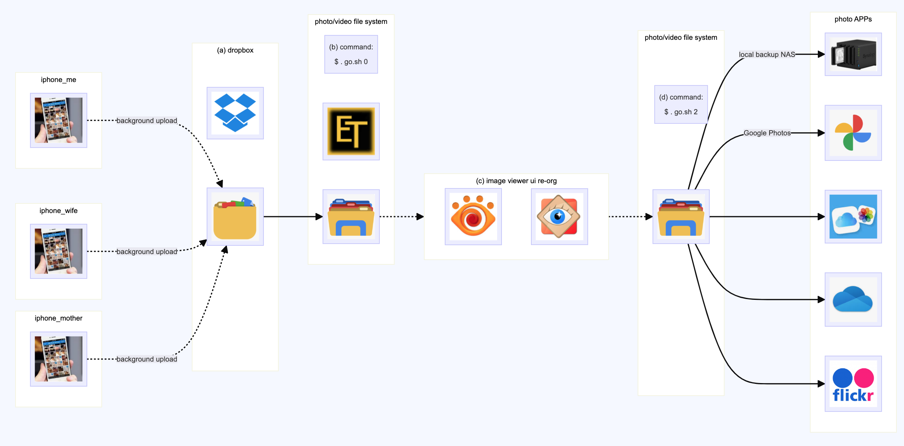

# exiftool_mac

The main purpose is that your family members often want to share photos with each other. But in the end, you have to distribute the collected and organized photos back to everyone. Your family members may not be computer savvy, so you hope these tasks can be done automatically without them noticing. I think it's better to leave the hard work to me (or let an automated program do it).

Here you'll need some tools. For automatically collecting and uploading photos from phones, I use Dropbox. For organizing photos, I use the Exiftool along with some shell scripts. Finally, I upload them to Google Photos to share with everyone.

- (a) upload photos
- (b) collect photos: $ . go.sh 0
- (c) image viewer ui re-org (optional)
- (d) backup photos: $ . go.sh 2
- (e) share photos




### (a) upload photos

Gather photos and videos from everyone's phones without them lifting a finger. 
- Have everyone install an automatic photo backup app (here I use Dropbox). 
- Every time they snap a pic or take a video, it'll automatically upload in the background. 
- <span style="color:red">They don't have to do a thing – that's the key.</span> 
- Have each family member share that folder with me (you would have to help them setting in the very frist time), so that I can see everyone's pics on my end.
- for example, in my end i could read:
```shell
~/Dropbox
jiechau$ ls -l
total 3056
drwxr-xr-x  4 jiechau staff  128  6  3 20:50 'Camera Uploads'
drwxr-xr-x  3 jiechau staff   96  9 12 21:19 'Camera Uploads - beatrice'
drwxr-xr-x 56 jiechau staff 1792  6  4 21:19 'Camera Uploads - elaine'
drwxr-xr-x  3 jiechau staff   96  3 31 21:19 'Camera Uploads - mabel'
drwxr-xr-x 43 jiechau staff 1376  2 26 19:28 'Camera Uploads - mammy'
drwxr-xr-x  3 jiechau staff   96 12  5 21:19 'Camera Uploads - mother'
```

### (b) collect photos: $ . go.sh 0

This step is to move photos from those Dropbox Camera Uploads folders to an organized folder. Their Dropbox spece is free by the way.

configure this file to suit your situation: config/config_vars.txt 
```shell
program_dir_base=/Users/jiechau/life_codes/exiftool_mac
working_dir_base=/Users/jiechau/exif_working_dir/_tmp_exiftool_mac
moved_dir_base=/Users/jiechau/exif_working_dir/_tmp_exiftool_mac/moved
problem_dir_base=/Users/jiechau/exif_working_dir/_tmp_exiftool_mac/problem_ones
dest_photo_dir_base=/Users/jiechau/exif_working_dir/UltraFit256/photo_latest
dest_video_dir_base=/Users/jiechau/exif_working_dir/UltraFit256/video_latest
remote_918_video_dir_base=video/video_latest
remote_918_photo_dir_base=photo/photo_latest
remote_213_video_dir_base=DS213file/_home/_jie/video/video_latest
remote_213_photo_dir_base=DS213file/_home/_jie/photo/photo_latest
```

every time you issue this command, it would collect all pics to '\$dest_photo_dir_base' and '\$dest_video_dir_base'

```shell
$ . go.sh 0
```

### (c) image viewer ui re-org (optional)

This step is optional. Now everything is under '\$dest_photo_dir_base' and '\$dest_video_dir_base', you could use some image viewer (e.g. XnView MP or FastStone) to review them, rename sub folder names, rotate the image ... etc.

Remember what left under '\$dest_photo_dir_base' and '\$dest_video_dir_base' in the end is what exactly to be sync to backup servers.

### (d) backup photos: $ . go.sh 2

Issue thie command:

```shell
$ . go.sh 2
```

And it will:

- sync everything from '\$dest_photo_dir_base' to '\$remote_918_photo_dir_base' and '\$remote_213_photo_dir_base'
- sync everything from '\$dest_video_dir_base' to '\$remote_213_video_dir_base' and '\$remote_213_photo_dir_base'

As you can see, here I'm just backing up the organized directory to two other locations (or more locations) using rsync. These two places could be servers or computers where you do further processing. 

For example, the location 192.168.123.162 is a NAS and performing a backup function. The other machine is a PC, 192.168.123.162, and will regularly synchronize the directory contents to the Google Photo album. For this part, you'll need to make some configurations on these remote servers/PCs according to your needs.

If the rsync commands involve account credentials, you can refer to the part in '\$ . ./go.sh 3'. Here you'll need to copy config/config_secrets_example.txt to config/config_secrets.txt. The IP address, username, and password used by rsync are recorded here.

### (e) share photos

Next, you need to allow your family members to see these organized photos at any time. For example, use Google Photos - you just need to help them install this app on their phones. Set up a shared album and share it with them. That shared album is where you will upload the organized photos in (d)

