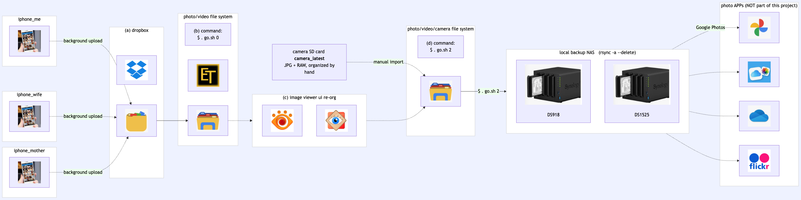

# exiftool_mac

The main purpose is that your family members often want to share photos with each other. But in the end, you have to distribute the collected and organized photos back to everyone. Your family members may not be computer savvy, so you hope these tasks can be done automatically without them noticing. I think it's better to leave the hard work to me (or let an automated program do it).

Here you'll need some tools. For automatically collecting and uploading photos from phones, I use Dropbox. For organizing photos, I use the Exiftool along with some shell scripts. Finally, I upload them to Google Photos to share with everyone.

The repo does three jobs:

1. **Re-organize** scattered phone uploads into a tidy, date-named local library (`go.sh 0`)
2. **Replicate** that organized library out to remote NAS servers (`go.sh 1` / `2` / `3`), and keep a scratch folder in two-way sync with the NAS (`go.sh cw`)
3. **Repair EXIF metadata** — datetime and GPS — on files whose tags are missing or wrong (the `changedate_*.sh` and `gps_*.sh` helpers)

- (a) upload photos
- (b) collect photos: `$ . go.sh 0`
- (c) image viewer ui re-org (optional)
- (d) backup photos: `$ . go.sh 2`
- (e) share photos



`go.sh` stops at the NAS. Pushing from there on to Google Photos / iCloud / OneDrive / Flickr is a separate job configured on the NAS itself — outside this repo. (`img/img1.png` is the older version of this diagram, which drew those uploads as coming straight out of `go.sh 2`.)


## Requirements

Homebrew versions of these are assumed — macOS ships older/incompatible builds of `date` and `rsync`, so `go.sh` puts `/opt/homebrew/bin` first on `PATH` and aliases both:

```shell
brew install exiftool coreutils rsync sshpass    # required
brew install mediainfo imagemagick               # mediainfo for showinfo.sh; imagemagick optional
```

`coreutils` provides `gdate`; the `changedate_*.sh` scripts need GNU-style `date --date=` parsing, so run them with `alias date=gdate` in effect. `sshpass` is only needed for modes `2` and `3`.

You also need the working directory tree to exist (`~/exif_working_dir/...`, see `config/config_vars.txt`) and each destination folder must contain a `it_exists.txt` sentinel file — see [The `it_exists.txt` sentinel](#the-it_existstxt-sentinel).


## The two tracks

Media reaches the organized library two different ways. Both end up under `UltraFit256/` and both get replicated by `go.sh 2`, but only the first one is automated.

| | phone track | camera track |
|---|---|---|
| source | Dropbox Camera Uploads folders | SD card from a real camera, imported by hand |
| destination | `photo_latest/`, `video_latest/` | `camera_latest/` |
| created by | `. go.sh 0` (exiftool renames by date) | you, manually |
| layout | `YYYY_MMDD_event/YYYY-MM-DD HH.MM.SS.jpg` | `YYYY_MMDD_camera_event/<body>-<lens>/` |
| contents | jpg, png, mov, mp4 | JPG + RAW (CR2), tif |
| replicated by | `. go.sh 1` / `2` / `3` | `. go.sh 1` / `2` / `3` |

**`go.sh 0` does not touch `camera_latest`.** That folder is yours to organize — keep RAW alongside JPG, group by shoot, subdivide by camera body and lens however you like. The sync steps treat it as an opaque directory to mirror.


## `go.sh` modes

`go.sh` must be **sourced**, not executed (it uses `return` and shell aliases):

```shell
cd ~/life_codes/exiftool_mac
. go.sh <0|1|2|3>
```

| mode | what it does | reaches |
|---|---|---|
| `0` | collect + rename from Dropbox into the organized library | local only |
| `1` | mirror to NAS over mounted SMB/AFP shares under `/Volumes/` | DS918 |
| `2` | mirror to NAS over rsync daemon port 873, on the home LAN | DS918 + DS1525 |
| `3` | mirror to DS918 over the internet | DS918 |
| `camera_working` (or `cw`) | **two-way** sync of the `camera_working` scratch folder, over the LAN | DS918 |

Modes `1` and `2` do the same thing by different transports; `2` is simpler because nothing has to be mounted in Finder first. Mode `3` is the away-from-home path and only covers DS918.

`camera_working` is the odd one out — see [Two-way sync: `camera_working`](#two-way-sync-camera_working). Everything else is a one-way mirror.

> Historical note: DS212 (`192.168.123.162`) was a third target. It is retired — its blocks are commented out in `go.sh` and `config/config_vars.txt` rather than deleted.


### (a) upload photos

Gather photos and videos from everyone's phones without them lifting a finger.
- Have everyone install an automatic photo backup app (here I use Dropbox).
- Every time they snap a pic or take a video, it'll automatically upload in the background.
- <span style="color:red">They don't have to do a thing – that's the key.</span>
- Have each family member share that folder with me (you would have to help them setting in the very frist time), so that I can see everyone's pics on my end.
- for example, in my end i could read:
```shell
~/Dropbox
jiechau$ ls -l
total 3056
drwxr-xr-x  4 jiechau staff  128  6  3 20:50 'Camera Uploads'
drwxr-xr-x  3 jiechau staff   96  9 12 21:19 'Camera Uploads - beatrice'
drwxr-xr-x 56 jiechau staff 1792  6  4 21:19 'Camera Uploads - elaine'
drwxr-xr-x  3 jiechau staff   96  3 31 21:19 'Camera Uploads - mabel'
drwxr-xr-x 43 jiechau staff 1376  2 26 19:28 'Camera Uploads - mammy'
drwxr-xr-x  3 jiechau staff   96 12  5 21:19 'Camera Uploads - mother'
```

The exact folders to drain are listed one per line in `config/config_sourcedir.txt`. Lines starting with `#` are skipped, and a folder that doesn't exist is silently ignored — so you can leave stale entries in place.

### (b) collect photos: `$ . go.sh 0`

This step is to move photos from those Dropbox Camera Uploads folders to an organized folder. Their Dropbox space is free by the way.

For each source folder, `go.sh 0`:

1. **Moves** (not copies) every `jpg/png/mov/mp4` out of Dropbox into a numbered staging dir under `$moved_dir_base`. This frees the family's Dropbox quota.
2. Lowercases uppercase file extensions (`.JPG` → `.jpg`).
3. Runs exiftool to rename each file into `$dest_photo_dir_base` / `$dest_video_dir_base` as `YYYY_MMDD_/YYYY-MM-DD HH.MM.SS.ext`, reading the date from EXIF and falling back to the filesystem mtime when the tag is missing:

   | media | preferred tag | fallback |
   |---|---|---|
   | photo | `EXIF:DateTimeOriginal` | `File:FileModifyDate` |
   | video | `QuickTime:CreateDate` | `QuickTime:MediaCreateDate` |

   Videos are read with `-api QuickTimeUTC -ee` so QuickTime timestamps land in local time instead of UTC.

Every time you issue this command, it collects all pics to `$dest_photo_dir_base` and `$dest_video_dir_base`:

```shell
$ . go.sh 0
```

### (c) image viewer ui re-org (optional)

This step is optional. Now everything is under `$dest_photo_dir_base` and `$dest_video_dir_base`, you could use some image viewer (e.g. XnView MP or FastStone) to review them, rename sub folder names, rotate the image ... etc. In practice the date-stamped `YYYY_MMDD_` folders get renamed to something meaningful — `2026_0801_hiking_milky_way`, `2026_0803_movie_toy_story_5`.

This is also the point where you'd fix any file whose date or location came out wrong — see [EXIF repair tools](#exif-repair-tools).

**Remember what is left under these folders at the end is exactly what gets synced to the backup servers.** The sync uses `rsync --delete`, so anything you remove locally is removed remotely on the next run.

### (d) backup photos: `$ . go.sh 2`

Issue this command:

```shell
$ . go.sh 2
```

And it will mirror all three libraries to both NAS boxes:

| local | DS918 (`192.168.123.163`) | DS1525 (`192.168.123.164`) |
|---|---|---|
| `$dest_photo_dir_base` | `photo/photo_latest` | `DSfile/_home/_jie/photo/photo_latest` |
| `$dest_video_dir_base` | `video/video_latest` | `DSfile/_home/_jie/video/video_latest` |
| `$dest_camera_dir_base` | `camera/camera_latest` | `DSfile/_home/_jie/camera/camera_latest` |

Note the remote paths are rsync **daemon module** paths (`host::module/subdir`), not filesystem paths — the leading component is the Synology shared-folder name as exported by the rsync service. Confirm what a box exports with:

```shell
rsync --port=873 admin@192.168.123.163::
```

Here I'm just backing up the organized directory to two other locations (or more) using rsync. These could be servers or computers where you do further processing — for example, one regularly synchronizes the directory contents up to a Google Photos album. For that part you'll need to configure the remote servers according to your needs.

Credentials live in `config/config_secrets.txt` — copy `config/config_secrets_example.txt` and fill it in. That file is gitignored.

Two quirks worth knowing:

- **`--protocol=29`** is forced on all mode-2 transfers. Since 2024/09/21 the newer protocol stopped working against these Synology daemons.
- Mode 2 probes reachability with a `--dry-run` fetch of `it_exists.txt` from the **video** module, then syncs photo and camera off that single result. If the probe fails, nothing is synced to that host.

### (e) share photos

Next, you need to allow your family members to see these organized photos at any time. For example, use Google Photos - you just need to help them install this app on their phones. Set up a shared album and share it with them. That shared album is where you will upload the organized photos in (d).


## The `it_exists.txt` sentinel

An empty file named `it_exists.txt` sits at the top of every source and destination library. It is a guard, not data — and because `rsync -a` copies it along with everything else, it propagates to the remotes on the first sync.

It exists because the local library lives on a removable drive (`UltraFit256`). If that drive is not mounted, the source path still *resolves* — it's just an empty directory — and `rsync -a --delete` from an empty source would cheerfully wipe the remote. The sentinel makes "the drive is mounted and this is the real library" checkable:

- `go.sh 0` only writes into a destination whose `it_exists.txt` is present
- `go.sh 1` checks the sentinel on the mounted `/Volumes/...` share before mirroring photo and video (for camera it checks the share directory plus the local sentinel, since a fresh remote share has no sentinel yet)
- `go.sh 2` and `3` use the remote sentinel as the reachability probe, and check the **local** `$dest_camera_dir_base/it_exists.txt` before mirroring camera
- `go.sh cw` refuses to run at all without the local `$dest_camera_working_dir_base/it_exists.txt`

If a sync mysteriously does nothing, a missing `it_exists.txt` is the first thing to check.


## Two-way sync: `camera_working`

`camera_working/` is a scratch area shared with the DS918 — somewhere to park a shoot that is still being culled, and pick it up again from either machine. Unlike every other path in this repo it syncs **both ways**:

```shell
$ . go.sh camera_working     # or the short form:
$ . go.sh cw
```

It checks the local sentinel, probes the remote, then runs rsync twice — pull first, then push — against `camera/camera_working` on the DS918 only.

**There is no `--delete` here, and that is deliberate.** A two-way sync cannot distinguish "deleted on this side" from "added on the other side"; with `--delete` on both passes the two runs destroy each other's files. The consequences are worth internalising:

- **Deletions do not propagate.** Remove a file on one side and the next run copies it straight back. To really delete something, delete it on both sides.
- **A rename looks like a duplicate.** The new name arrives, the old name never leaves.
- **Editing the same file on both sides loses one version.** `-u` (`--update`) means the newer mtime wins; the older copy is overwritten with no conflict file kept.

`@eaDir` (Synology's thumbnail directories), `.DS_Store` and `.Trashes` are excluded in both directions.

If you need real bidirectional sync with deletion tracking, plain rsync cannot do it — that needs a tool that keeps state between runs, such as `unison` or `rclone bisync`.


## EXIF repair tools

Files that arrive without usable metadata — scans, screen recordings, video exported from an editor, footage off a camera with a dead clock — need their tags written by hand. These scripts are the tools for that. They are independent of `go.sh`; run them from whatever directory holds the files, before step (d) syncs them.

All of them **overwrite files in place** (`-overwrite_original`). Work on a copy if you care.

| script | scope | usage |
|---|---|---|
| `showinfo.sh` | inspect one file | `. showinfo.sh aaa.mp4` |
| `changedate_step.sh` | every image in the current dir | `. changedate_step.sh 2023-01-03 18:30:00` |
| `changedate_mp4.sh` | a single file named `aaa.mp4` | `. changedate_mp4.sh 2023-01-03 18:30:00` |
| `changedate_mov.sh` | a single file named `aaa.mov` | `. changedate_mov.sh 2023-01-03 18:30:00` |
| `changedate_mp4_batch.sh` | every `.mp4` in the current dir | `. changedate_mp4_batch.sh 2023-01-03 18:30:00` |
| `gps_*.sh` | stamp GPS onto `aaa.mp4` | `. gps_ccd.sh` |

Run any `changedate_*` script with no arguments and it prints a ready-to-paste example stamped with the current time.

**`showinfo.sh`** dumps the date fields from three angles — exiftool, mediainfo, and `stat` — because they don't always agree, and knowing *which* one is wrong tells you what to fix.

**`changedate_step.sh`** is the one for a batch of stills: it walks the images in the current directory and assigns consecutive timestamps **one second apart**, starting from the datetime you pass. That keeps a scanned or metadata-less set in the order you want once a viewer sorts them by date. It writes the filesystem mtime (`touch`), the macOS creation date (`setfile`), and the EXIF `DateTimeOriginal` + `CreateDate` tags.

**`changedate_mp4.sh` / `changedate_mov.sh`** each fix one video and require it to be named literally `aaa.mp4` / `aaa.mov` — copy the script next to the file, rename the file, run it. Both prompt for a keypress before writing. Timestamps are written as `+08:00`; adjust if you are not in Taiwan. The tag that actually matters for these NAS/viewer workflows is `QuickTime:CreateDate` — `MediaCreateDate` is set too, but it's the former that tools read.

**`changedate_mp4_batch.sh`** applies *the same* timestamp to every `.mp4` in the current directory — no stepping. It is the bluntest tool here; it prompts once and then rewrites everything in the folder.

**`gps_*.sh`** copy a GPS coordinate onto `aaa.mp4` by lifting `QuickTime:GPSCoordinates` from a known-good reference clip in `gps_sample/`. Each variant is one saved location (`ccd`, `468`, `hby`, `hess`) — a reference file *is* the coordinate, which is why they are checked in. To add a location, take a geotagged clip there, drop it in `gps_sample/`, and copy one of the scripts. Verify with:

```shell
exiftool -api QuickTimeUTC -ee -G aaa.mp4 | grep -i gps
```


## Configuration

| file | contents | in git |
|---|---|---|
| `config/config_vars.txt` | all local and remote paths | yes |
| `config/config_sourcedir.txt` | Dropbox folders to drain, one per line | yes |
| `config/config_secrets.txt` | NAS hosts, ports, passwords | **no** (gitignored) |
| `config/config_secrets_example.txt` | template for the above | yes |

Both config files are `.`-sourced by `go.sh`, so they are shell assignments — no spaces around `=`, and `#` comments out a line.

`config/config_vars.txt`:

```shell
program_dir_base=/Users/jiechau/life_codes/exiftool_mac
working_dir_base=/Users/jiechau/exif_working_dir/_tmp_exiftool_mac
moved_dir_base=/Users/jiechau/exif_working_dir/_tmp_exiftool_mac/moved
problem_dir_base=/Users/jiechau/exif_working_dir/_tmp_exiftool_mac/problem_ones
# local organized library (on the UltraFit256 drive)
dest_photo_dir_base=/Users/jiechau/exif_working_dir/UltraFit256/photo_latest
dest_video_dir_base=/Users/jiechau/exif_working_dir/UltraFit256/video_latest
dest_camera_dir_base=/Users/jiechau/exif_working_dir/UltraFit256/camera_latest
# two-way scratch folder, . go.sh cw
dest_camera_working_dir_base=/Users/jiechau/exif_working_dir/UltraFit256/camera_working
# remote rsync module paths
remote_918_video_dir_base=video/video_latest
remote_918_photo_dir_base=photo/photo_latest
remote_918_camera_dir_base=camera/camera_latest
remote_918_camera_working_dir_base=camera/camera_working
remote_1525_video_dir_base=DSfile/_home/_jie/video/video_latest
remote_1525_photo_dir_base=DSfile/_home/_jie/photo/photo_latest
remote_1525_camera_dir_base=DSfile/_home/_jie/camera/camera_latest
```

Adding a new library (say `screenshots_latest`) means: a `dest_*` var, one `remote_<host>_*` var per NAS, and one rsync block per mode in `go.sh`.


## Troubleshooting

| symptom | cause |
|---|---|
| sync runs but transfers nothing | missing `it_exists.txt`, or the UltraFit256 drive isn't mounted |
| `exiftool: command not found` under cron | `PATH` — `go.sh` exports `/opt/homebrew/bin:/usr/local/bin` for this reason |
| cron: `operation not permitted` | grant `/usr/sbin/cron` Full Disk Access in System Settings → Privacy |
| rsync hangs or errors against Synology | needs `--protocol=29` (already set in mode 2) |
| video timestamps off by hours | missing `-api QuickTimeUTC`; QuickTime dates are stored in UTC |
| `date: illegal option` | BSD `date` instead of `gdate`; `alias date=gdate` |
